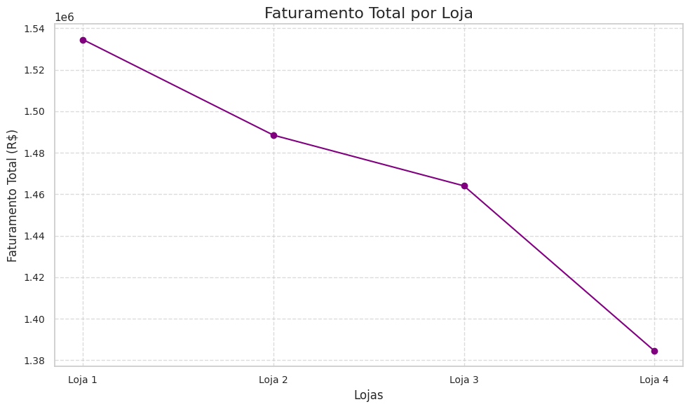
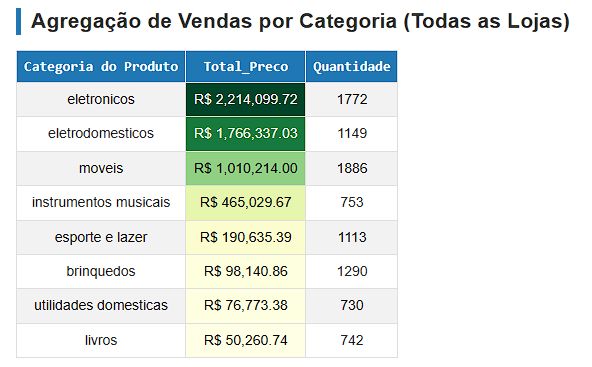

# 📊 Case: Estratégia e Performance de Vendas (Rede do Sr. João)

Este projeto apresenta uma análise profunda de dados de faturamento, logística e satisfação do cliente para uma rede de 4 lojas. O objetivo central é fornecer um embasamento técnico para a decisão de **desinvestimento (venda)** de uma das unidades, visando a otimização do capital do grupo.

---

## 🎯 O Problema de Negócio
O Sr. João, proprietário da rede, precisa identificar qual unidade possui o menor potencial de retorno estratégico para realizar sua venda. A análise deve equilibrar:
1.  **Faturamento Bruto**: Volume total de vendas.
2.  **Eficiência Logística**: Custo médio de frete por operação.
3.  **Satisfação do Cliente**: NPS (Net Promoter Score) e avaliações médias.

---

## 💡 Principais Descobertas (Insights)

### 1. O Paradoxo da Loja 4
Identificamos que a **Loja 4** possui a operação logística mais barata da rede (**R$ 31,28** de frete médio). No entanto, essa eficiência não se traduz em faturamento. A unidade registrou a menor receita total (**R$ 1.384.497,58**), indicando que o baixo custo de frete é apenas reflexo de um baixo volume de entregas ou proximidade geográfica limitada, sem escala para crescimento.

### 2. Referência em Qualidade
A **Loja 3** consolidou-se como o pilar de satisfação da rede, mantendo uma média de **4,05**, sendo a unidade com maior fidelização de clientes.

### 3. Mix de Produtos "Estrela"
As categorias de **Eletrônicos** e **Eletrodomésticos** são os motores de receita em todas as lojas, com destaque para a `TV Led UHD 4K` e o `Celular Plus X42`.

### 📊 Visualização de Performance

  

### 📊 Faturamento Total

  

### 📊 Visualização de Eficiência Logística vs. Performance de Vendas

---

## 🏆 Recomendação Final
**Recomenda-se a venda da Loja 4.** A justificativa baseia-se na liberação de capital de uma unidade de baixo giro para reinvestimento em:
* **Escala na Loja 1 e 2**: Unidades com maior volume financeiro.
* **Fidelização na Loja 3**: Unidade com melhor percepção de marca.

---

## 🛠️ Tecnologias Utilizadas
* **Python 3**
* **Pandas**: Agregação e limpeza (removendo ruídos como 'Total Geral').
* **Seaborn & Matplotlib**: Visualizações avançadas (gráficos de eixo duplo e matrizes de eficiência).
* **Styler (Pandas)**: Tabelas financeiras formatadas com gradientes visuais.

---

## 📖 Como visualizar este projeto?
1.  **Notebook**: O arquivo principal está na raiz como `analise_vendas.ipynb`.
2.  **Execução Direta**: Você pode rodar o código e interagir com os gráficos clicando no botão **Open in Colab** no topo deste documento.

---
*Projeto desenvolvido como parte do Challenge de Data Science - Alura Store.*
